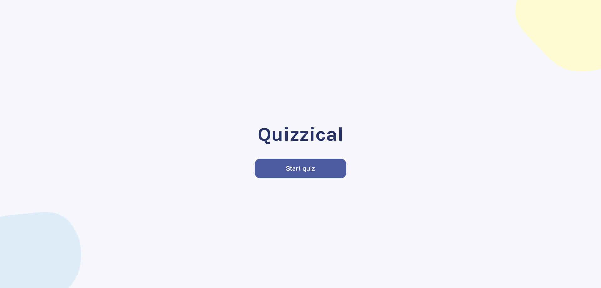
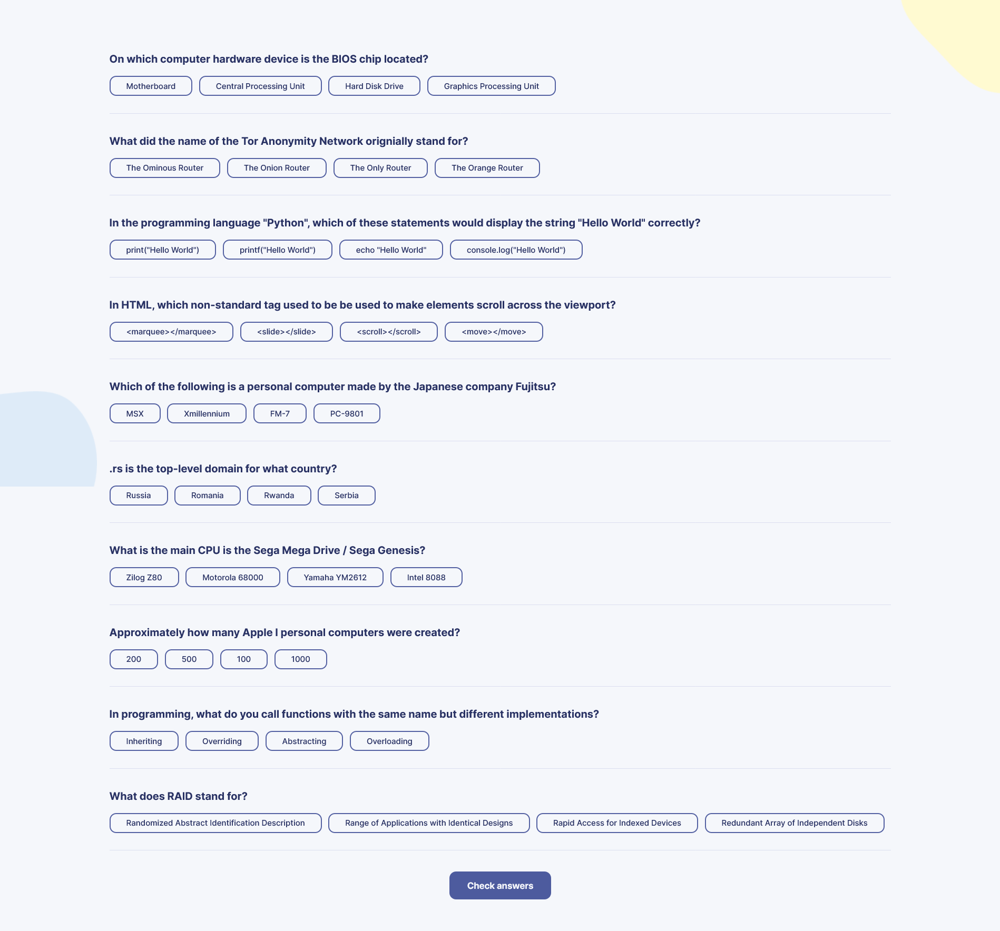
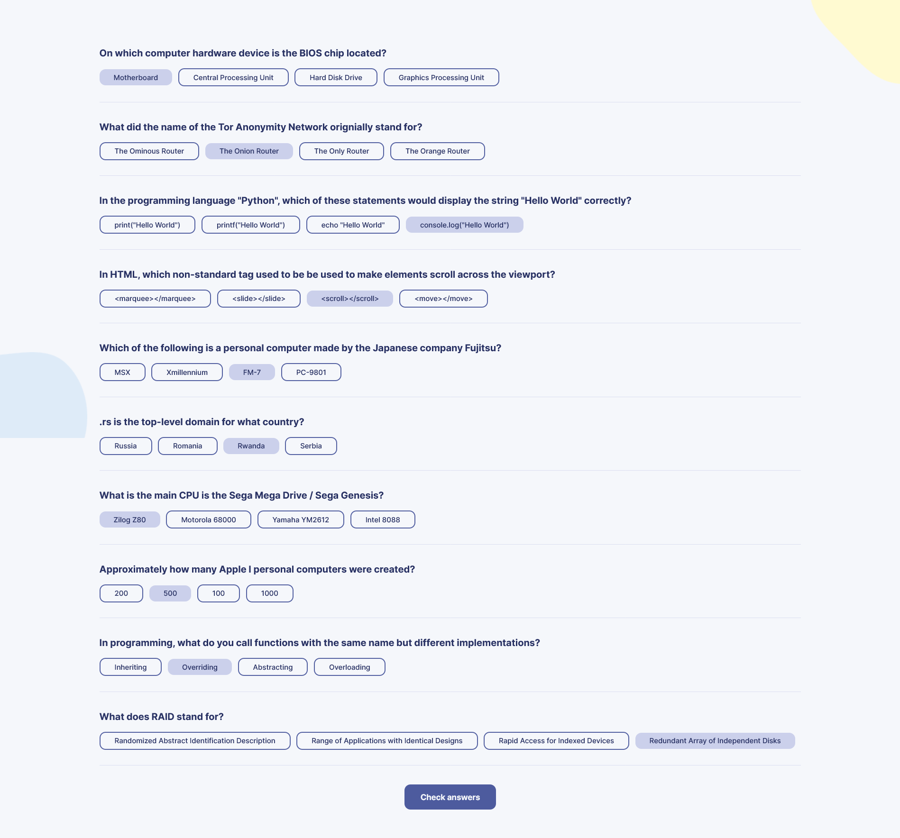
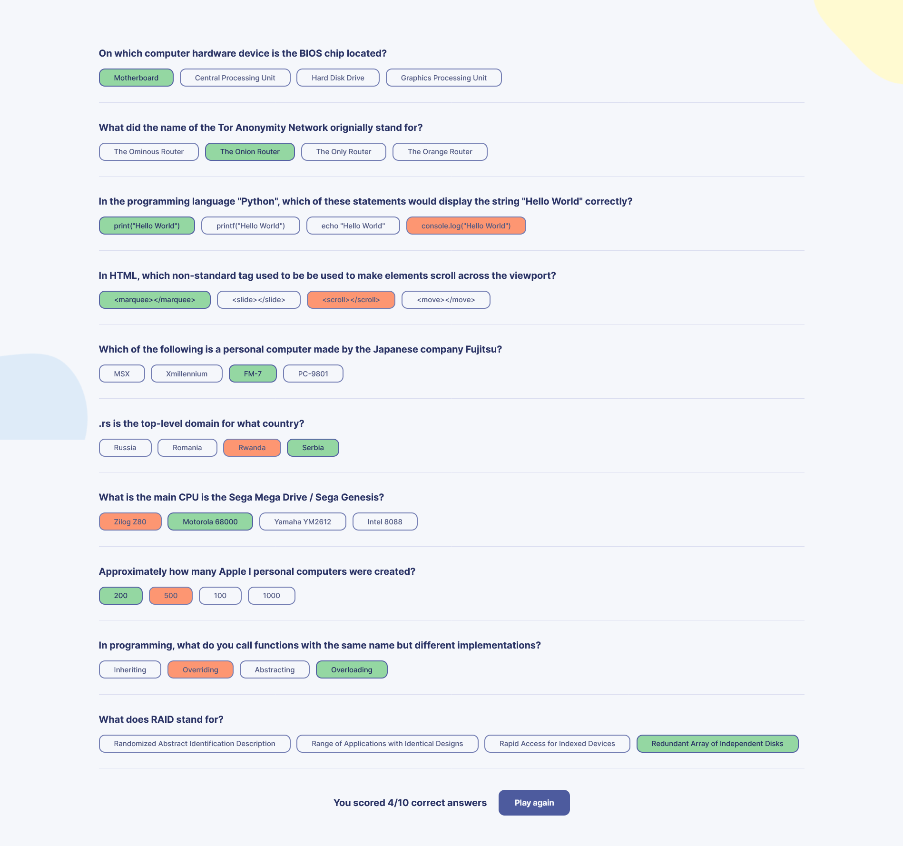

# Quizzical - A random quiz generator
Live view at https://saragadalmawla.github.io/Quizzical/  
This is a solution to the Solo project assigned by Bob Ziroll at the scrimba react boot camp.  
Link to the course: https://scrimba.com/learn/learnreact  

## Table of contents

- [Overview](#overview)
  - [The challenge](#the-challenge)
  - [Screenshot](#screenshot)
- [My process](#my-process)
  - [Built with](#built-with)
  - [Continued development](#continued-development)

## Overview
### The challenge

Users should be able to:

- Click start quiz to get random questions in the feild of computer science
- Solve the questions
- Get the corrections after clicking check answers
- Play again with new random questions

### Screenshots

#### Front page

#### Quiz generated

#### Answers selected

#### Answers corrected

## My process

### Built with

- Semantic HTML5 markup
- CSS custom properties
- Flexbox
- React V18.2
- Open Trivia DB

### Continued development
- Add user options (no of questions, feild of questions, etc)
- Add a dark mode
- Enhance responsiveness

